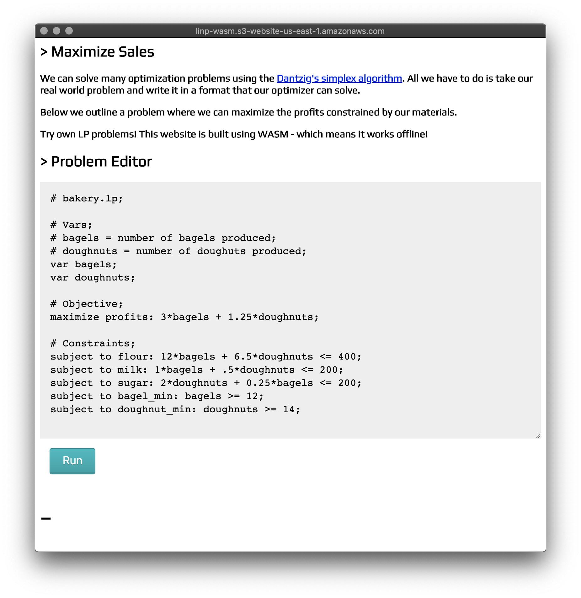

## LINP-WASM

Solve linear prgramming problems in your browser!

Demo Here: [http://linp-wasm.s3-website-us-east-1.amazonaws.com/](http://linp-wasm.s3-website-us-east-1.amazonaws.com/)




### Build
```
wasm-pack build --target no-modules
wasm-opt -Os ./pkg/linp_wasm_bg.wasm -o ./pkg/linp_wasm_opt.wasm
```

### Dev
check the bingen README

### Optimizations
https://rustwasm.github.io/wasm-bindgen/examples/add.html